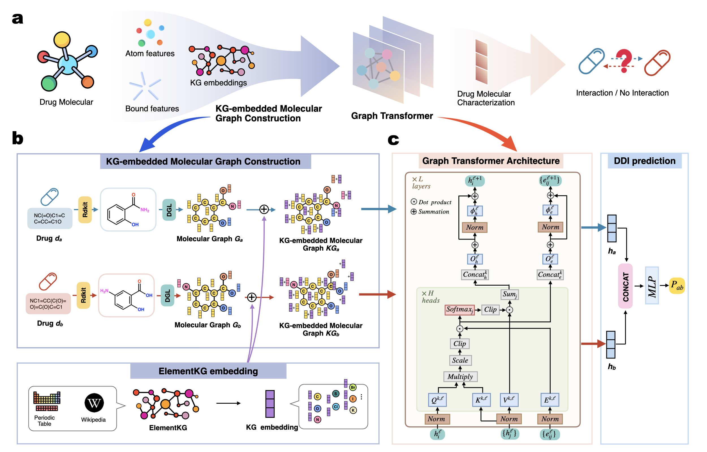

# Transformer-based graphs for drug-drug interaction with chemical knowledge embedding

This repository is the official implementation of TRACE.

## Brief introduction

We propose TRACE, a new drug-drug interaction (DDI) prediction method, termed **TR**ansformer-based Graph Representation Le**A**rning with **C**hemical **E**mbedding.

### Model

During the construction of molecular graphs, we embed the elemental information from ElementKG into the original drug molecular graphs, resulting in KG-enhanced molecular graphs that combine both structural features and chemical domain knowledge.

After obtaining the KG-enhanced molecular graphs, we input them into the Graph Transformer module to further extract high-level representations of drug molecules. The Graph Transformer leverages self-attention mechanisms to dynamically aggregate local and global information within the graph, effectively capturing complex structural and chemical patterns critical for DDI prediction. The representations of two drug molecules are then concatenated and fed into a downstream multilayer perceptron (MLP), which is trained to predict DDIs.



## Requirements

To run our code, please install dependency packages.

```
python                       3.8
torch                        1.13.1
torch-scatter                2.0.9
rdkit                        2022.9.5
numpy                        1.24.3
dgl                          1.1.2+cu117
scikit-learn                 1.3.2
```

## Quick start

Run `graphpreprocess.py` to generate the molecular graph data. The output will be saved to the path specified by `data_bin_dir` in the YAML configuration file.

```bash
>> python graphpreprocess.py --config_file configs/config_deepddi.yml
```

```bash
>> python train_task.py --config_file configs/config_deepddi.yml
```

| **Parameter** | **Description** | **Example/Default Value** |
| --- | --- | --- |
| data_dir | Path to downstream task data file (.csv) | None |
| data_bin_dir | Path to graph data file (.pth) | None |
| id_to_index_dir | Path to drug ID and index mapping file (.csv) | None |
| best_model_dir | Path to save the best model | None |
| experiment_name | Name of the experiment | None |
| in_feats | Input feature dimension | 196 |
| in_edge_feats | Edge feature dimension | 6 |
| hidden_size | Hidden layer size | 128 |
| num_layers | Number of layers (e.g., Transformer/GCN layers) | 8 |
| num_class | Number of output classes | 2 |
| mlp_activation | Activation function used in MLP | silu |
| mlp_dropout_rate | Dropout rate in MLP | 0.5 |
| mlp_num_layers | Number of layers in MLP | 2 |
| mlp_batch_norm | Whether to use batch normalization in MLP | false |
| mlp_hidden_size | Hidden size in MLP | 2048 |
| short_cut | Whether to use shortcut connections | false |
| seed | Random seed | 123 |
| num_epochs | Number of training epochs | 5000 |
| batch_size | Batch size | 512 |
| learning_rate | Learning rate | 0.001 |
| checkpoint_dir | Directory to save checkpoints/outputs | ./output/ |
| patience | Patience for early stopping | 20 |
| early_stop_criteria | Early stopping evaluation metric | macro avg_f1-score |
| early_stop_mode | Early stopping mode (higher/lower) | higher |
| gpu | Whether to use GPU | true |
| criterion | Loss function | BCELoss |
| class_weight_dir | Path to class weights file (if any) | null |
| label_smoothing | Label smoothing factor | 0.1 |

## Dataset

- Download Drug-Drug Interaction dataset from https://github.com/isjakewong/MIRACLE/tree/main/MIRACLE/datachem.
    - Since these datasets include duplicate instances in train/validation/test split, merge the train/validation/test dataset.
    - Generate random negative counterparts by sampling a complement set of positive drug pairs as negatives.
    - Split the dataset into 6:2:2 ratio, and create separate csv file for each train/validation/test splits.