# Transformer-based graphs for drug-drug interaction with chemical knowledge embedding

This repository is the official implementation of TRACE.

## Brief introduction

We propose TRACE, a new drug-drug interaction (DDI) prediction method, termed **TR**ansformer-based Graph Representation Le**A**rning with **C**hemical **E**mbedding.

### Model

During the construction of molecular graphs, we embed the elemental information from ElementKG into the original drug molecular graphs, resulting in KG-enhanced molecular graphs that combine both structural features and chemical domain knowledge.

After obtaining the KG-enhanced molecular graphs, we input them into the Graph Transformer module to further extract high-level representations of drug molecules. The Graph Transformer leverages self-attention mechanisms to dynamically aggregate local and global information within the graph, effectively capturing complex structural and chemical patterns critical for DDI prediction. The representations of two drug molecules are then concatenated and fed into a downstream multilayer perceptron (MLP), which is trained to predict DDIs.

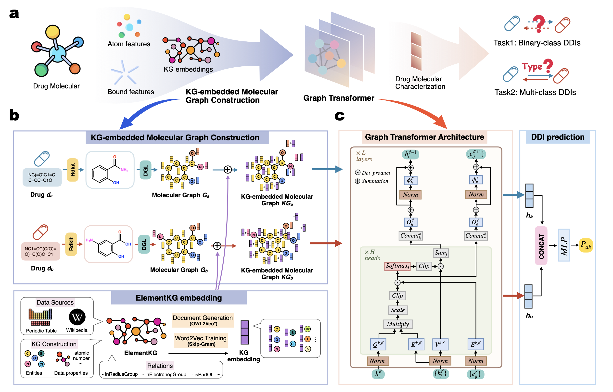

## Requirements

To run our code, please install dependency packages.

```
python                       3.8
torch                        1.13.1
torch-scatter                2.0.9
rdkit                        2022.9.5
numpy                        1.24.3
dgl                          1.1.2+cu117
scikit-learn                 1.3.2
```

## Quick start

Run `graphpreprocess.py` to generate the molecular graph data. The output will be saved to the path specified by `data_bin_dir` in the YAML configuration file.

```bash
>> python graphpreprocess.py --config_file configs/config_deepddi.yml
```

```bash
>> python train_task.py --config_file configs/config_deepddi.yml
```

| **Parameter** | **Description** | **Example/Default Value** |
| --- | --- | --- |
| data_dir | Path to downstream task data file (.csv) | None |
| data_bin_dir | Path to graph data file (.pth) | None |
| id_to_index_dir | Path to drug ID and index mapping file (.csv) | None |
| best_model_dir | Path to save the best model | None |
| experiment_name | Name of the experiment | None |
| in_feats | Input feature dimension | 196 |
| in_edge_feats | Edge feature dimension | 6 |
| hidden_size | Hidden layer size | 128 |
| num_layers | Number of layers (e.g., Transformer/GCN layers) | 8 |
| num_class | Number of output classes | 2 |
| mlp_activation | Activation function used in MLP | silu |
| mlp_dropout_rate | Dropout rate in MLP | 0.5 |
| mlp_num_layers | Number of layers in MLP | 2 |
| mlp_batch_norm | Whether to use batch normalization in MLP | false |
| mlp_hidden_size | Hidden size in MLP | 2048 |
| short_cut | Whether to use shortcut connections | false |
| seed | Random seed | 123 |
| num_epochs | Number of training epochs | 5000 |
| batch_size | Batch size | 512 |
| learning_rate | Learning rate | 0.001 |
| checkpoint_dir | Directory to save checkpoints/outputs | ./output/ |
| patience | Patience for early stopping | 20 |
| early_stop_criteria | Early stopping evaluation metric | macro avg_f1-score |
| early_stop_mode | Early stopping mode (higher/lower) | higher |
| gpu | Whether to use GPU | true |
| criterion | Loss function | BCELoss |
| class_weight_dir | Path to class weights file (if any) | null |
| label_smoothing | Label smoothing factor | 0.1 |

## Dataset

- Download Drug-Drug Interaction dataset from https://github.com/isjakewong/MIRACLE/tree/main/MIRACLE/datachem.
    - Since these datasets include duplicate instances in train/validation/test split, merge the train/validation/test dataset.
    - Generate random negative counterparts by sampling a complement set of positive drug pairs as negatives.
    - Split the dataset into 6:2:2 ratio, and create separate csv file for each train/validation/test splits.

## Representative high-risk molecular motifs and drugs identified by TRACE for different DDI types

For each DDI type, we report the top-ranked molecular motifs identified by attention-based analysis in TRACE. Pair Count denotes the number of DDI pairs in which the motif appears among the top-ranked substructures of either drug, and Pair Coverage (%) represents the proportion of such pairs relative to all DDI pairs of that type. Example drugs are selected as the most frequently occurring drugs containing the corresponding motif within the given DDI type, and their molecular structures are shown for interpretability.

DDI Type 1: #Drug1 may increase the photosensitizing activities of #Drug2.

| Motif (SMILES + Structure) | Representative Drug ID(s) | Drug (Structure) |
| :-: | :-: | :-: |
| C1Cc2cc3ccc(cc4nc(cc5ccc(cc1n2)[nH]5)C=C4)[nH]3<br>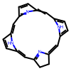 | DB00460 | 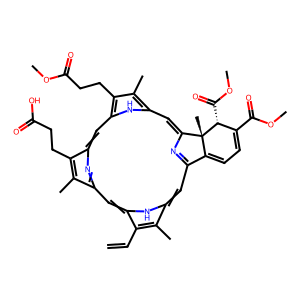 |
| c1ccoc1<br>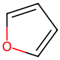 | DB04571<br>DB00553 | 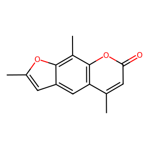<br>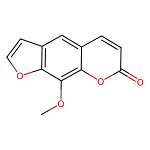 |
| c1ccsc1<br>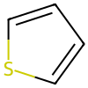 | DB01600 | 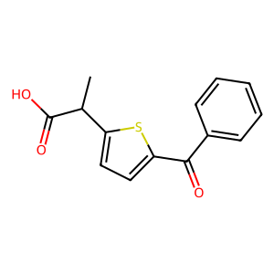 |

---

DDI Type 2: #Drug1 may increase the anticholinergic activities of #Drug2.

| Motif (SMILES + Structure) | Representative Drug ID(s) | Drug (Structure) |
| :-: | :-: | :-: |
| c1ccsc1<br> | DB01409<br>DB06153 | 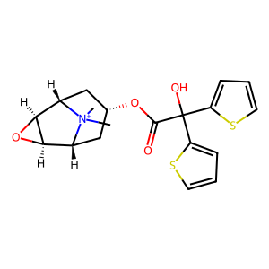<br>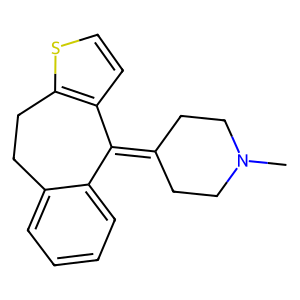 |
| C1CNCCN1<br>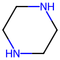 | DB06148<br>DB00670 | 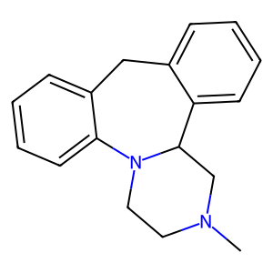<br>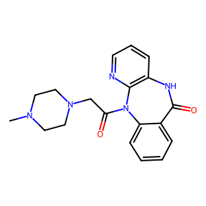 |
| C1C[N+]2CCC1CC2<br>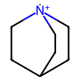 | DB09076 | 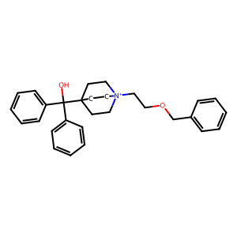 |

---

DDI Type 3: The bioavailability of #Drug2 can be decreased when combined with #Drug1.

| Motif (SMILES + Structure) | Representative Drug ID(s) | Drug (Structure) |
| :-: | :-: | :-: |
| c1ccoc1<br> | DB08906 | 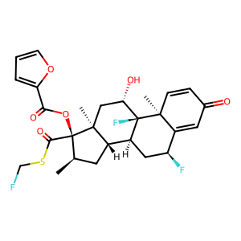 |
| C1OCCO1<br>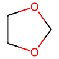 | DB00288 | 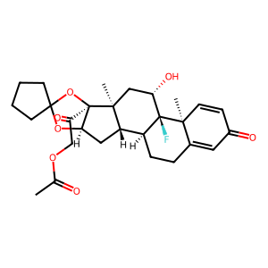 |
| C1CCCC1<br> | DB04574<br>DB00588<br>DB08970 | 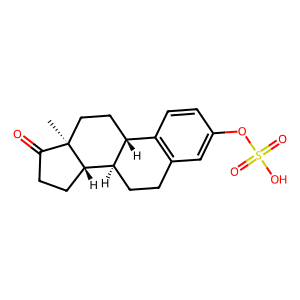<br>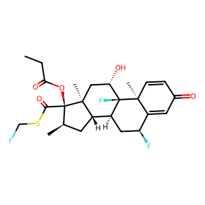<br>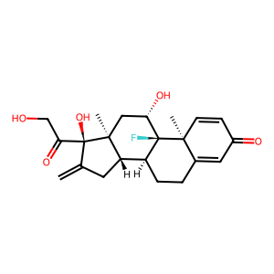 |

---

DDI Type 4: The metabolism of #Drug2 can be increased when combined with #Drug1.

| Motif (SMILES + Structure) | Representative Drug ID(s) | Drug (Structure) |
| :-: | :-: | :-: |
| C1CCNCN1<br> | DB00794<br>DB01174<br>DB00312 | 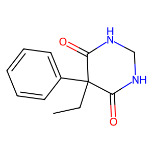<br>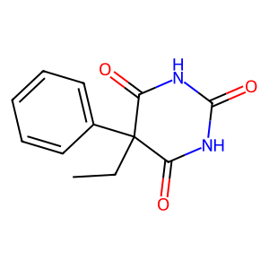<br>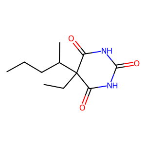 |
| c1ccncc1<br>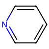 | DB00238<br>DB09280<br>DB01220 | 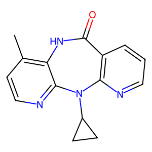<br>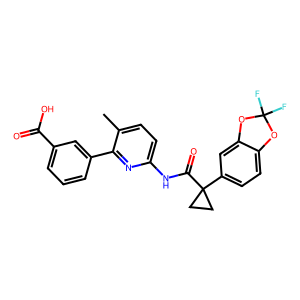<br>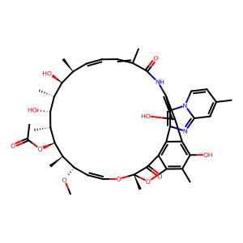 |
| C1CCNCC1<br>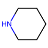 | DB00615<br>DB01074<br>DB11614 | 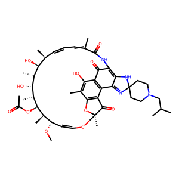<br>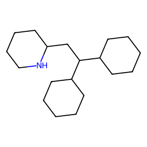<br>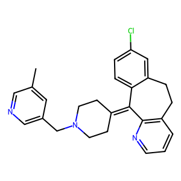 |

---

DDI Type 5: #Drug1 may decrease the vasoconstricting activities of #Drug2.

| Motif (SMILES + Structure) | Representative Drug ID(s) | Drug (Structure) |
| :-: | :-: | :-: |
| c1cncnc1<br>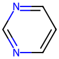 | DB00346<br>DB01162<br>DB00457 | 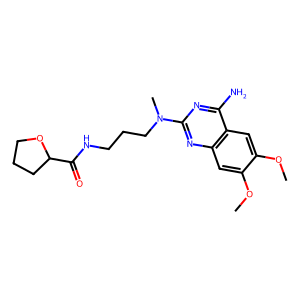<br>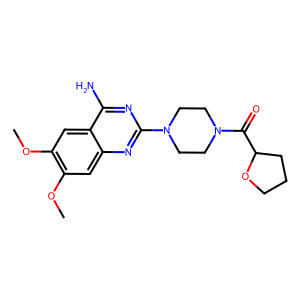<br>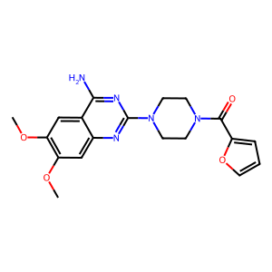 |
| C1CNCCN1<br> | DB01162<br>DB00457<br>DB00590 | <br><br>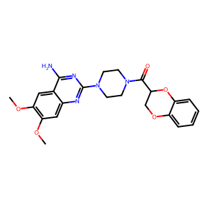 |
| c1cOCCO1<br>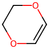 | DB00590 |  |

---

DDI Type 6: #Drug1 may increase the anticoagulant activities of #Drug2.

| Motif (SMILES + Structure) | Representative Drug ID(s) | Drug (Structure) |
| :-: | :-: | :-: |
| c1ccncc1<br> | DB09075<br>DB05266<br>DB00235 | 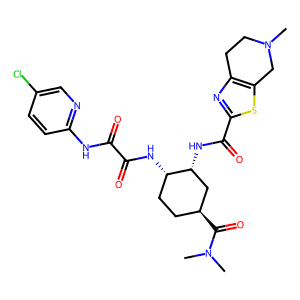<br>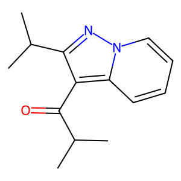<br>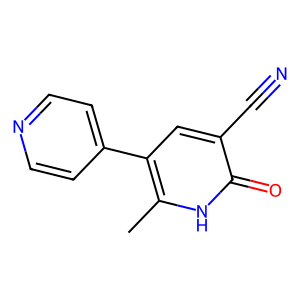 |
| c1ccsc1<br> | DB06228<br>DB06209<br>DB00758 | 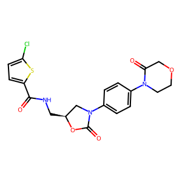<br>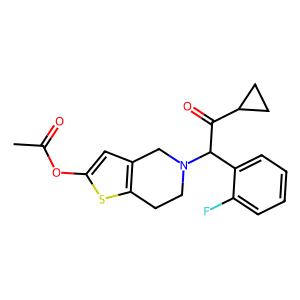<br>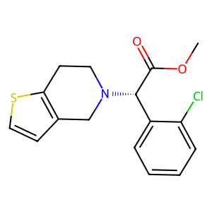 |
| c1cscn1<br>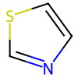 | DB09075<br>DB01254<br>DB00814 | <br>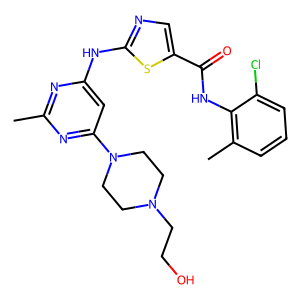<br>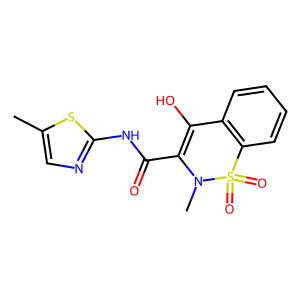 |

---

DDI Type 7: #Drug1 may increase the ototoxic activities of #Drug2.

| Motif (SMILES + Structure) | Representative Drug ID(s) | Drug (Structure) |
| :-: | :-: | :-: |
| C1CCOCC1<br> | DB03615<br>DB01172<br>DB01421 | 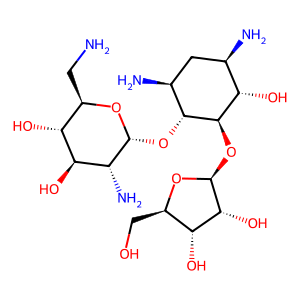<br>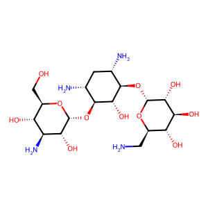<br>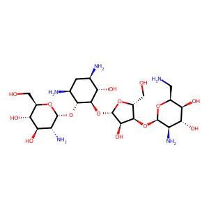 |
| C1CCOC1<br> | DB01421<br>DB00452 | <br> |
| C1CCCCO1<br> | DB00955 |  |

---

DDI Type 8: The therapeutic efficacy of #Drug2 can be increased when used in combination with #Drug1.

| Motif (SMILES + Structure) | Representative Drug ID(s) | Drug (Structure) |
| :-: | :-: | :-: |
| c1cC2CCN[C@H](C1)C2<br> | DB00295<br>DB01466<br>DB00844 | <br><br> |
| C1CCNCC1<br> | DB01100<br>DB00297<br>DB01501 | <br><br> |
| C1CNCCN1<br> | DB00363<br>DB04908<br>DB00875 | <br><br> |

---

DDI Type 9: #Drug1 may increase the hypoglycemic activities of #Drug2.

| Motif (SMILES + Structure) | Representative Drug ID(s) | Drug (Structure) |
| :-: | :-: | :-: |
| c1ccncc1<br> | DB01132<br>DB00468<br>DB00779 | <br><br> |
| c1cncnc1<br> | DB00359<br>DB06203<br>DB08882 | <br><br> |
| c1cc[nH]c1<br> | DB01268<br>DB01200<br>DB06791 | <br><br> |

---

DDI Type 10: #Drug1 may increase the antihypertensive activities of #Drug2.

| Motif (SMILES + Structure) | Representative Drug ID(s) | Drug (Structure) |
| :-: | :-: | :-: |
| C1=NCCN1<br> | DB00484<br>DB00575<br>DB06694 | <br><br> |
| c1cncnc1<br> | DB06237<br>DB06403<br>DB09242 | <br><br> |
| c1cc[nH]c1<br> | DB00820<br>DB00206<br>DB01089 | <br><br> |

---

DDI Type 11: The serum concentration of the active metabolites of #Drug2 can be reduced when #Drug2 is used in combination with #Drug1 resulting in a loss in efficacy.

| Motif (SMILES + Structure) | Representative Drug ID(s) | Drug (Structure) |
| :-: | :-: | :-: |
| c1ccsc1<br> | DB00758<br>DB06209<br>DB00208 | <br><br> |
| C1CNPOC1<br> | DB01181 |  |
| c1cCNCC1<br> | DB00758<br>DB00208 | <br> |

---

DDI Type 12: #Drug1 may decrease the anticoagulant activities of #Drug2.

| Motif (SMILES + Structure) | Representative Drug ID(s) | Drug (Structure) |
| :-: | :-: | :-: |
| c1c[nH]cn1<br> | DB00763<br>DB01033 | <br> |
| C1CCCCO1<br> | DB00686 |  |
| C1CCCO1<br> | DB01395 |  |

---

DDI Type 13: The absorption of #Drug2 can be decreased when combined with #Drug1.

| Motif (SMILES + Structure) | Representative Drug ID(s) | Drug (Structure) |
| :-: | :-: | :-: |
| C1CNCCN1<br> | DB00251<br>DB01167<br>DB01263 | <br><br> |
| c1ccncc1<br> | DB01188<br>DB01243<br>DB01422 | <br><br> |
| C1CCOCC1<br> | DB06697<br>DB00646 | <br> |

---

DDI Type 14: #Drug1 may decrease the bronchodilatory activities of #Drug2.

| Motif (SMILES + Structure) | Representative Drug ID(s) | Drug (Structure) |
| :-: | :-: | :-: |
| c1cncnc1<br> | DB01223<br>DB00651<br>DB00277 | <br><br> |
| c1c[nH]cn1<br> | DB01223<br>DB00277 | <br> |
| c1cc[nH]c1<br> | DB08807 |  |

---

DDI Type 15: #Drug1 may increase the cardiotoxic activities of #Drug2.

| Motif (SMILES + Structure) | Representative Drug ID(s) | Drug (Structure) |
| :-: | :-: | :-: |
| c1ccncc1<br> | DB01030<br>DB00724<br>DB00537 | <br><br> |
| c1cncnc1<br> | DB09054<br>DB00441<br>DB00619 | <br><br> |
| C1CCOC1<br> | DB00441<br>DB00631<br>DB01262 | <br><br> |

---

DDI Type 16: #Drug1 may increase the central nervous system depressant (CNS depressant) activities of #Drug2.

| Motif (SMILES + Structure) | Representative Drug ID(s) | Drug (Structure) |
| :-: | :-: | :-: |
| C1CNCCN1<br> | DB00557<br>DB00370<br>DB09068 | <br><br> |
| c1ccncc1<br> | DB00425<br>DB08883<br>DB00370 | <br><br> |
| c1cC2CCN[C@H](C1)C2<br> | DB00956<br>DB00921<br>DB00611 | <br><br> |

---

DDI Type 17: #Drug1 may decrease the neuromuscular blocking activities of #Drug2.

| Motif (SMILES + Structure) | Representative Drug ID(s) | Drug (Structure) |
| :-: | :-: | :-: |
| c1cC[N+]CC1<br> | DB01226<br>DB01199<br>DB00565 | <br><br> |
| c1ccncc1<br> | DB00214 |  |
| c1cOc2ccc(cc2)C[C@@H]2NCCc3ccc(cc32)Oc2cccc(c2)CC1<br> | DB01199 |  |

---

DDI Type 18: #Drug1 can cause an increase in the absorption of #Drug2 resulting in an increased serum concentration and potentially a worsening of adverse effects.

| Motif (SMILES + Structure) | Representative Drug ID(s) | Drug (Structure) |
| :-: | :-: | :-: |
| C1CCNCC1<br> | DB06701<br>DB00422 | <br> |
| c1ccncc1<br> | DB00884 |  |
| c1cscn1<br> | DB00927<br>DB00585 | <br> |

---

DDI Type 19: #Drug1 may increase the vasoconstricting activities of #Drug2.

| Motif (SMILES + Structure) | Representative Drug ID(s) | Drug (Structure) |
| :-: | :-: | :-: |
| C1=CCNCC1<br> | DB00353<br>DB01253<br>DB00696 | <br><br> |
| C1CCNCC1<br> | DB00248<br>DB00320 | <br> |
| c1cc[nH]c1<br> | DB01200<br>DB01186<br>DB08807 | <br><br> |

---

DDI Type 20: #Drug1 may increase the QTc-prolonging activities of #Drug2.

| Motif (SMILES + Structure) | Representative Drug ID(s) | Drug (Structure) |
| :-: | :-: | :-: |
| c1ccncc1<br> | DB01165<br>DB00537<br>DB01137 | <br><br> |
| C1CNCCN1<br> | DB00537<br>DB00875<br>DB00363 | <br><br> |
| C1CCNCC1<br> | DB00502<br>DB04844<br>DB01267 | <br><br> |

---

DDI Type 21: #Drug1 may increase the neuromuscular blocking activities of #Drug2.

| Motif (SMILES + Structure) | Representative Drug ID(s) | Drug (Structure) |
| :-: | :-: | :-: |
| c1cC[N+]CC1<br> | DB01226<br>DB00565<br>DB01199 | <br><br> |
| c1ccncc1<br> | DB00908<br>DB00468<br>DB01427 | <br><br> |
| C1CCNC1<br> | DB01627<br>DB01190 | <br> |

---

DDI Type 22: #Drug1 may increase the adverse neuromuscular activities of #Drug2.

| Motif (SMILES + Structure) | Representative Drug ID(s) | Drug (Structure) |
| :-: | :-: | :-: |
| c1cC[N+]CC1<br> | DB01226 |  |
| c1ccoc1<br> | DB08906 |  |
| C1OCCO1<br> | DB00288 |  |

---

DDI Type 23: #Drug1 may increase the stimulatory activities of #Drug2.

| Motif (SMILES + Structure) | Representative Drug ID(s) | Drug (Structure) |
| :-: | :-: | :-: |
| c1cNccCC1<br> | DB00726<br>DB00458<br>DB01151 | <br><br> |
| C1CNCCN1<br> | DB00543 |  |
| C1=NccOcc1<br> | DB00543 |  |

---

DDI Type 24: #Drug1 may increase the hypocalcemic activities of #Drug2.

| Motif (SMILES + Structure) | Representative Drug ID(s) | Drug (Structure) |
| :-: | :-: | :-: |
| C1CCOCC1<br> | DB01421<br>DB00919<br>DB01172 | <br><br> |
| c1ccncc1<br> | DB00884 |  |
| C1CCOC1<br> | DB01421<br>DB00452 | <br> |

---

DDI Type 25: #Drug1 may increase the atrioventricular blocking (AV block) activities of #Drug2.

| Motif (SMILES + Structure) | Representative Drug ID(s) | Drug (Structure) |
| :-: | :-: | :-: |
| C1=NCCN1<br> | DB00575<br>DB06694<br>DB06711 | <br><br> |
| c1cc[nH]c1<br> | DB08807<br>DB01136<br>DB01200 | <br><br> |
| C1CCNCC1<br> | DB00320<br>DB01267<br>DB00734 | <br><br> |

---

DDI Type 26: #Drug1 may decrease the antiplatelet activities of #Drug2.

| Motif (SMILES + Structure) | Representative Drug ID(s) | Drug (Structure) |
| :-: | :-: | :-: |
| c1ccsc1<br> | DB00758<br>DB06209 | <br> |
| c1cCNCC1<br> | DB00758 |  |
| c1cC2CCN[C@H](C1)C2<br> | DB00295 |  |

---

DDI Type 27: #Drug1 may increase the neuroexcitatory activities of #Drug2.

| Motif (SMILES + Structure) | Representative Drug ID(s) | Drug (Structure) |
| :-: | :-: | :-: |
| c1ccncc1<br> | DB04576<br>DB00817<br>DB00487 | <br><br> |
| C1CNCCN1<br> | DB01059<br>DB01208<br>DB01149 | <br><br> |
| c1ccnnc1<br> | DB00827<br>DB00972<br>DB00805 | <br><br> |

---

DDI Type 28: #Drug1 may increase the dermatologic adverse activities of #Drug2.

| Motif (SMILES + Structure) | Representative Drug ID(s) | Drug (Structure) |
| :-: | :-: | :-: |
| c1cncnc1<br> | DB00619 |  |
| C1CNCCN1<br> | DB00619 |  |
| C1ccCN1<br> | DB01041 |  |

---

DDI Type 29: #Drug1 may decrease the diuretic activities of #Drug2.

| Motif (SMILES + Structure) | Representative Drug ID(s) | Drug (Structure) |
| :-: | :-: | :-: |
| c1ccncc1<br> | DB00214<br>DB00608<br>DB00469 | <br><br> |
| C1=CNScc1<br> | DB00554<br>DB00469<br>DB06725 | <br><br> |
| c1ccsc1<br> | DB00744<br>DB01600 | <br> |

---

DDI Type 30: #Drug1 may increase the orthostatic hypotensive activities of #Drug2.

| Motif (SMILES + Structure) | Representative Drug ID(s) | Drug (Structure) |
| :-: | :-: | :-: |
| C1CCNCN1<br> | DB01351<br>DB01154<br>DB00849 | <br><br> |
| c1cncnc1<br> | DB00457<br>DB00590<br>DB01162 | <br><br> |
| C1CNCCN1<br> | DB00457<br>DB00590<br>DB01162 | <br><br> |

---

DDI Type 31: The risk or severity of hypertension can be increased when #Drug2 is combined with #Drug1.

| Motif (SMILES + Structure) | Representative Drug ID(s) | Drug (Structure) |
| :-: | :-: | :-: |
| C1NCCO1<br> | DB09245<br>DB00614 | <br> |
| C1COCCN1<br> | DB01171<br>DB00805 | <br> |
| c1c[s+]ccn1<br> | DB09241 |  |

---

DDI Type 32: #Drug1 may increase the sedative activities of #Drug2.

| Motif (SMILES + Structure) | Representative Drug ID(s) | Drug (Structure) |
| :-: | :-: | :-: |
| c1ccsc1<br> | DB05271<br>DB00334<br>DB09017 | <br><br> |
| c1cscn1<br> | DB00413 |  |
| C1CNCCN1<br> | DB00334<br>DB01224<br>DB00656 | <br><br> |

---

DDI Type 33: The risk or severity of QTc prolongation can be increased when #Drug1 is combined with #Drug2.

| Motif (SMILES + Structure) | Representative Drug ID(s) | Drug (Structure) |
| :-: | :-: | :-: |
| c1ccncc1<br> | DB08881<br>DB00908<br>DB00468 | <br><br> |
| c1cc[nH]c1<br> | DB08881<br>DB00150<br>DB11699 | <br><br> |
| C1CNCCN1<br> | DB11730<br>DB00875<br>DB01624 | <br><br> |

---

DDI Type 34: #Drug1 may increase the immunosuppressive activities of #Drug2.

| Motif (SMILES + Structure) | Representative Drug ID(s) | Drug (Structure) |
| :-: | :-: | :-: |
| c1cncnc1<br> | DB08895<br>DB01280<br>DB08877 | <br><br> |
| c1cc[nH]c1<br> | DB08895<br>DB08877<br>DB06603 | <br><br> |
| C1CNCCC1<br> | DB08895 |  |

---

DDI Type 35: #Drug1 may increase the neurotoxic activities of #Drug2.

| Motif (SMILES + Structure) | Representative Drug ID(s) | Drug (Structure) |
| :-: | :-: | :-: |
| C1CNCCN1<br> | DB00850<br>DB00875<br>DB09128 | <br><br> |
| C1CCNCC1<br> | DB09224<br>DB06144<br>DB01267 | <br><br> |
| c1cSccN1<br> | DB00477<br>DB01614<br>DB00433 | <br><br> |

---

DDI Type 36: #Drug1 may increase the antipsychotic activities of #Drug2.

| Motif (SMILES + Structure) | Representative Drug ID(s) | Drug (Structure) |
| :-: | :-: | :-: |
| C1CNCCN1<br> | DB00298<br>DB01238<br>DB00850 | <br><br> |
| C1CCNCC1<br> | DB06144<br>DB01608<br>DB09286 | <br><br> |
| c1cSccN1<br> | DB00679<br>DB01608<br>DB00477 | <br><br> |

---

DDI Type 37: #Drug1 may decrease the antihypertensive activities of #Drug2.

| Motif (SMILES + Structure) | Representative Drug ID(s) | Drug (Structure) |
| :-: | :-: | :-: |
| c1cc[nH]c1<br> | DB01392<br>DB08807<br>DB01136 | <br><br> |
| c1ccncc1<br> | DB06725<br>DB04951<br>DB00469 | <br><br> |
| c1cnccn1<br> | DB00594<br>DB00384<br>DB00484 | <br><br> |

---

DDI Type 38: #Drug1 may increase the vasodilatory activities of #Drug2.

| Motif (SMILES + Structure) | Representative Drug ID(s) | Drug (Structure) |
| :-: | :-: | :-: |
| c1cncnc1<br> | DB06237 |  |
| c1cOCO1<br> | DB00820 |  |
| c1cCNCC1<br> | DB00820 |  |

---

DDI Type 39: #Drug1 may increase the constipating activities of #Drug2.

| Motif (SMILES + Structure) | Representative Drug ID(s) | Drug (Structure) |
| :-: | :-: | :-: |
| c1cC2CCN[C@H](C1)C2<br> | DB00652<br>DB00844<br>DB00497 | <br><br> |
| C1CCNCC1<br> | DB00454<br>DB00813<br>DB00967 | <br><br> |
| c1cOCC1<br> | DB00956<br>DB00318<br>DB01466 | <br><br> |

---

DDI Type 40: #Drug1 may increase the respiratory depressant activities of #Drug2.

| Motif (SMILES + Structure) | Representative Drug ID(s) | Drug (Structure) |
| :-: | :-: | :-: |
| C1CCOCC1<br> | DB03615<br>DB01421<br>DB01172 | <br><br> |
| c1cC[N+]CC1<br> | DB01336<br>DB00565<br>DB01226 | <br><br> |
| C1CCOC1<br> | DB01421<br>DB00452 | <br> |

---

DDI Type 41: #Drug1 may increase the hypotensive and central nervous system depressant (CNS depressant) activities of #Drug2.

| Motif (SMILES + Structure) | Representative Drug ID(s) | Drug (Structure) |
| :-: | :-: | :-: |
| C1CCNCC1<br> | DB00454 |  |
| C1NCCO1<br> | DB00614<br>DB09245 | <br> |
| C1COCCN1<br> | DB00805<br>DB01171 | <br> |

---

DDI Type 42: The risk or severity of hyperkalemia can be increased when #Drug1 is combined with #Drug2.

| Motif (SMILES + Structure) | Representative Drug ID(s) | Drug (Structure) |
| :-: | :-: | :-: |
| c1cnccn1<br> | DB00384<br>DB00594 | <br> |
| C1CNCCNCCNCCNCCNCCNCCNCCNCCNCCNCCN1<br> | DB00091 |  |
| C1CCCCOCCNCCC2CCC[C@@H](CCCC\C=C\C1)O2<br> | DB00864 |  |

---

DDI Type 43: The protein binding of #Drug2 can be decreased when combined with #Drug1.

| Motif (SMILES + Structure) | Representative Drug ID(s) | Drug (Structure) |
| :-: | :-: | :-: |
| C1=CNCSC1<br> | DB01327 |  |
| c1nncs1<br> | DB01327 |  |
| C1CNCN1<br> | DB00252 |  |

---

DDI Type 44: #Drug1 may increase the central neurotoxic activities of #Drug2.

| Motif (SMILES + Structure) | Representative Drug ID(s) | Drug (Structure) |
| :-: | :-: | :-: |
| C1NCCO1<br> | DB09245<br>DB00614 | <br> |
| C1COCCN1<br> | DB00805<br>DB01171 | <br> |
| c1ccnnc1<br> | DB00805 |  |

---

DDI Type 45: #Drug1 may decrease effectiveness of #Drug2 as a diagnostic agent.

| Motif (SMILES + Structure) | Representative Drug ID(s) | Drug (Structure) |
| :-: | :-: | :-: |
| C1C[C@@H]2CCC[C@H]1N2<br> | DB08824<br>DB00907 | <br> |
| C1CNCCN1<br> | DB01149<br>DB00490<br>DB00543 | <br><br> |
| C1CCNCC1<br> | DB00813<br>DB00422<br>DB06701 | <br><br> |

---

DDI Type 46: #Drug1 may increase the bronchoconstrictory activities of #Drug2.

| Motif (SMILES + Structure) | Representative Drug ID(s) | Drug (Structure) |
| :-: | :-: | :-: |
| c1cc[nH]c1<br> | DB01136<br>DB08807 | <br> |
| c1ccsc1<br> | DB09204 |  |
| c1cOCCC1<br> | DB04861 |  |

---

DDI Type 47: The metabolism of #Drug2 can be decreased when combined with #Drug1.

| Motif (SMILES + Structure) | Representative Drug ID(s) | Drug (Structure) |
| :-: | :-: | :-: |
| C1CNCCN1<br> | DB00224<br>DB01026<br>DB00619 | <br><br> |
| c1cncnc1<br> | DB04868<br>DB00619<br>DB09054 | <br><br> |
| c1ccncc1<br> | DB00951<br>DB00468<br>DB00608 | <br><br> |
| C1=CC=CS1<br /> | DB00208<br />DB00758<br />DB00744 | <br /><br /> |
| C12=CC=CC=C1C=CC=N2<br /> | DB01232<br />DB00468<br />DB00608 | <br /><br /> |

---

DDI Type 48: #Drug1 may increase the myopathic rhabdomyolysis activities of #Drug2.

| Motif (SMILES + Structure) | Representative Drug ID(s) | Drug (Structure) |
| :-: | :-: | :-: |
| c1c[n+]ccn1<br> | DB09055 |  |
| C1CCCCO1<br> | DB00227 |  |
| c1ccncc1<br> | DB08860 |  |

---

DDI Type 49: The risk or severity of adverse effects can be increased when #Drug1 is combined with #Drug2.

| Motif (SMILES + Structure) | Representative Drug ID(s) | Drug (Structure) |
| :-: | :-: | :-: |
| C1CCNCC1<br> | DB09286<br>DB00454<br>DB01002 | <br><br> |
| C1CNCCN1<br> | DB00363<br>DB01224<br>DB00298 | <br><br> |
| c1cC2CCN[C@H](C1)C2<br> | DB00295<br>DB00497<br>DB00844 | <br><br> |

---

DDI Type 50: The risk or severity of heart failure can be increased when #Drug2 is combined with #Drug1.

| Motif (SMILES + Structure) | Representative Drug ID(s) | Drug (Structure) |
| :-: | :-: | :-: |
| c1cncnc1<br> | DB06203<br>DB08882 | <br> |
| C1CCCCN1<br> | DB00491<br>DB00419 | <br> |
| c1ccsc1<br> | DB08907 |  |

---

DDI Type 51: #Drug1 may increase the hypercalcemic activities of #Drug2.

| Motif (SMILES + Structure) | Representative Drug ID(s) | Drug (Structure) |
| :-: | :-: | :-: |
| c1cSNCN1<br> | DB00774 |  |
| c1cnoc1<br> | DB01406 |  |
| S<br> | DB01021<br>DB00232<br>DB01324 | <br><br> |

---

DDI Type 52: #Drug1 may decrease the analgesic activities of #Drug2.

| Motif (SMILES + Structure) | Representative Drug ID(s) | Drug (Structure) |
| :-: | :-: | :-: |
| c1cc[nH]c1<br> | DB11699<br>DB00757 | <br> |
| C1ccCCN1<br> | DB00377 |  |
| C1C[C@H]2CCC[C@@H]1N2<br> | DB11699 |  |

---

DDI Type 53: #Drug1 may increase the antiplatelet activities of #Drug2.

| Motif (SMILES + Structure) | Representative Drug ID(s) | Drug (Structure) |
| :-: | :-: | :-: |
| c1ccncc1<br> | DB00235<br>DB05266 | <br> |
| C1CCCCO1<br> | DB01296 |  |
| C1CCCO1<br> | DB01240 |  |

---

DDI Type 54: #Drug1 may increase the bradycardic activities of #Drug2.

| Motif (SMILES + Structure) | Representative Drug ID(s) | Drug (Structure) |
| :-: | :-: | :-: |
| c1cc[nH]c1<br> | DB01136<br>DB06791<br>DB08877 | <br><br> |
| C1CCCOC1<br> | DB00390<br>DB00511<br>DB01078 | <br><br> |
| C1C=CCO1<br> | DB00390<br>DB01092<br>DB01078 | <br><br> |

---

DDI Type 55: #Drug1 may increase the hyponatremic activities of #Drug2.

| Motif (SMILES + Structure) | Representative Drug ID(s) | Drug (Structure) |
| :-: | :-: | :-: |
| c1cCOC1<br> | DB00215<br>DB01175 | <br> |
| c1cSNCN1<br> | DB00774 |  |
| c1cOCO1<br> | DB00715 |  |

---

DDI Type 56: The risk or severity of hypotension can be increased when #Drug1 is combined with #Drug2.

| Motif (SMILES + Structure) | Representative Drug ID(s) | Drug (Structure) |
| :-: | :-: | :-: |
| c1cnccn1<br> | DB00594<br>DB00384 | <br> |
| c1cncnc1<br> | DB11106<br>DB00384 | <br> |
| C1CCCO1<br> | DB00700<br>DB01395 | <br> |

---

DDI Type 57: #Drug1 may increase the nephrotoxic activities of #Drug2.

| Motif (SMILES + Structure) | Representative Drug ID(s) | Drug (Structure) |
| :-: | :-: | :-: |
| C1CNCCNCCNCCNCCNCCNCCNCCNCCNCCNCCN1<br> | DB00091 |  |
| C1CCCCOCCNCCC2CCC[C@@H](CCCC\C=C\C1)O2<br> | DB00864<br>DB00337 | <br> |
| C1CCOCC1<br> | DB01172<br>DB00452<br>DB00684 | <br><br> |

---

DDI Type 58: #Drug1 may decrease the cardiotoxic activities of #Drug2.

| Motif (SMILES + Structure) | Representative Drug ID(s) | Drug (Structure) |
| :-: | :-: | :-: |
| C1C=CCO1<br> | DB01092<br>DB01078<br>DB01396 | <br><br> |
| C1CCCOC1<br> | DB00511<br>DB01078<br>DB01396 | <br><br> |
| c1ccncc1<br> | DB06771<br>DB08911<br>DB00537 | <br><br> |

---

DDI Type 59: #Drug1 may increase the ulcerogenic activities of #Drug2.

| Motif (SMILES + Structure) | Representative Drug ID(s) | Drug (Structure) |
| :-: | :-: | :-: |
| C1C[C@H]2CCC[C@@H]1N2<br> | DB00572<br>DB00245<br>DB00424 | <br><br> |
| c1cOccC1<br> | DB00940<br>DB00782 | <br> |
| C1CCNCC1<br> | DB00340<br>DB00967 | <br> |

---

DDI Type 60: #Drug1 may increase the hypotensive activities of #Drug2.

| Motif (SMILES + Structure) | Representative Drug ID(s) | Drug (Structure) |
| :-: | :-: | :-: |
| C1=CNC=CC1<br> | DB09236<br>DB00528<br>DB06712 | <br><br> |
| C1CCNCN1<br> | DB00599<br>DB00474<br>DB01351 | <br><br> |
| c1cncnc1<br> | DB00734<br>DB00346<br>DB08932 | <br><br> |

---

DDI Type 61: #Drug1 may decrease the stimulatory activities of #Drug2.

| Motif (SMILES + Structure) | Representative Drug ID(s) | Drug (Structure) |
| :-: | :-: | :-: |
| C1CNCCN1<br> | DB09128<br>DB00831<br>DB01624 | <br><br> |
| C1CCNCC1<br> | DB01100<br>DB06144<br>DB04842 | <br><br> |
| c1cSccN1<br> | DB01614<br>DB00433<br>DB01608 | <br><br> |

---

DDI Type 62: The bioavailability of #Drug2 can be increased when combined with #Drug1.

| Motif (SMILES + Structure) | Representative Drug ID(s) | Drug (Structure) |
| :-: | :-: | :-: |
| C1=CCNCC1<br> | DB01200<br>DB01253<br>DB00353 | <br><br> |
| C1CCNCC1<br> | DB00950<br>DB00699<br>DB00248 | <br><br> |
| c1cc[nH]c1<br> | DB01200<br>DB01186 | <br> |

---

DDI Type 63: #Drug1 may increase the myelosuppressive activities of #Drug2.

| Motif (SMILES + Structure) | Representative Drug ID(s) | Drug (Structure) |
| :-: | :-: | :-: |
| C1CCNC1<br> | DB01348<br>DB00492<br>DB00584 | <br><br> |
| c1c[nH]cn1<br> | DB01033 |  |
| c1cncnc1<br> | DB00440 |  |

---

DDI Type 64: #Drug1 may increase the serotonergic activities of #Drug2.

| Motif (SMILES + Structure) | Representative Drug ID(s) | Drug (Structure) |
| :-: | :-: | :-: |
| c1cc[nH]c1<br> | DB00150<br>DB11699<br>DB00757 | <br><br> |
| C1NCCO1<br> | DB09042<br>DB00601<br>DB09245 | <br><br> |
| c1cC2CCN[C@H](C1)C2<br> | DB09209<br>DB00854<br>DB00652 | <br><br> |

---

DDI Type 65: #Drug1 may increase the excretion rate of #Drug2 which could result in a lower serum level and potentially a reduction in efficacy.

| Motif (SMILES + Structure) | Representative Drug ID(s) | Drug (Structure) |
| :-: | :-: | :-: |
| c1cC2CCN[C@H](C1)C2<br> | DB01192<br>DB01466<br>DB00295 | <br><br> |
| c1cOCC1<br> | DB01466<br>DB00318<br>DB00956 | <br><br> |
| C1CCNCC1<br> | DB01081<br>DB00813<br>DB00454 | <br><br> |

---

DDI Type 66: The risk or severity of bleeding can be increased when #Drug1 is combined with #Drug2.

| Motif (SMILES + Structure) | Representative Drug ID(s) | Drug (Structure) |
| :-: | :-: | :-: |
| c1ccncc1<br> | DB12364<br>DB09075<br>DB00608 | <br><br> |
| c1ccsc1<br> | DB06228<br>DB00744<br>DB01600 | <br><br> |
| C1=CNScc1<br> | DB00814<br>DB00554<br>DB06725 | <br><br> |

---

DDI Type 67: #Drug1 can cause a decrease in the absorption of #Drug2 resulting in a reduced serum concentration and potentially a decrease in efficacy.

| Motif (SMILES + Structure) | Representative Drug ID(s) | Drug (Structure) |
| :-: | :-: | :-: |
| c1ccncc1<br> | DB00467<br>DB01137<br>DB01044 | <br><br> |
| c1cSccN1<br> | DB01069<br>DB01614<br>DB01246 | <br><br> |
| C1CNCCN1<br> | DB01059<br>DB01208<br>DB00850 | <br><br> |

---

DDI Type 68: #Drug1 may increase the hyperkalemic activities of #Drug2.

| Motif (SMILES + Structure) | Representative Drug ID(s) | Drug (Structure) |
| :-: | :-: | :-: |
| C1CCCO1<br> | DB01395<br>DB00700 | <br> |
| c1cncnc1<br> | DB00440<br>DB01349<br>DB00384 | <br><br> |
| C1CCNC1<br> | DB01348<br>DB09477<br>DB00584 | <br><br> |

---

DDI Type 69: #Drug1 may increase the analgesic activities of #Drug2.

| Motif (SMILES + Structure) | Representative Drug ID(s) | Drug (Structure) |
| :-: | :-: | :-: |
| c1cC2CCN[C@H](C1)C2<br> | DB00611<br>DB01466<br>DB00652 | <br><br> |
| c1cOCC1<br> | DB01466<br>DB01551<br>DB00318 | <br><br> |
| C1CCNCC1<br> | DB06738<br>DB01081<br>DB00454 | <br><br> |

---

DDI Type 70: The therapeutic efficacy of #Drug2 can be decreased when used in combination with #Drug1.

| Motif (SMILES + Structure) | Representative Drug ID(s) | Drug (Structure) |
| :-: | :-: | :-: |
| c1ccncc1<br> | DB06698<br>DB01132<br>DB00608 | <br><br> |
| C1CNCCN1<br> | DB06148<br>DB00334<br>DB08815 | <br><br> |
| C1CCNCC1<br> | DB00358<br>DB09097<br>DB00843 | <br><br> |

---

DDI Type 71: #Drug1 may increase the hypertensive activities of #Drug2.

| Motif (SMILES + Structure) | Representative Drug ID(s) | Drug (Structure) |
| :-: | :-: | :-: |
| C1=CCNCC1<br> | DB00696<br>DB01253<br>DB00353 | <br><br> |
| C1NCCO1<br> | DB09245<br>DB00614<br>DB00601 | <br><br> |
| C1CCNCC1<br> | DB00248<br>DB00320<br>DB00422 | <br><br> |

---

DDI Type 72: #Drug1 may decrease the excretion rate of #Drug2 which could result in a higher serum level.

| Motif (SMILES + Structure) | Representative Drug ID(s) | Drug (Structure) |
| :-: | :-: | :-: |
| C1CCOCC1<br> | DB00684<br>DB03615<br>DB00452 | <br><br> |
| C1CCOC1<br> | DB00452<br>DB01421 | <br> |
| c1ccncc1<br> | DB00469<br>DB04951<br>DB04552 | <br><br> |

---

DDI Type 73: The serum concentration of #Drug2 can be increased when it is combined with #Drug1.

| Motif (SMILES + Structure) | Representative Drug ID(s) | Drug (Structure) |
| :-: | :-: | :-: |
| C1CNCCN1<br> | DB09073<br>DB00243<br>DB01149 | <br><br> |
| c1ccncc1<br> | DB09048<br>DB08881<br>DB01220 | <br><br> |
| c1cncnc1<br> | DB09330<br>DB01254<br>DB08864 | <br><br> |
| C1(C=CC=C2)=C2OCO1<br /> | DB09118<br />DB00715 <br />DB00820 | <br /><br /> |

---

DDI Type 74: #Drug1 may increase the fluid retaining activities of #Drug2.

| Motif (SMILES + Structure) | Representative Drug ID(s) | Drug (Structure) |
| :-: | :-: | :-: |
| C1CCCCO1<br> | DB00621 |  |
| c1cn[nH]c1<br> | DB06718 |  |
| c1cnoc1<br> | DB01406 |  |

---

DDI Type 75: The serum concentration of #Drug2 can be decreased when it is combined with #Drug1.

| Motif (SMILES + Structure) | Representative Drug ID(s) | Drug (Structure) |
| :-: | :-: | :-: |
| c1ccncc1<br> | DB09280<br>DB08881<br>DB00238 | <br><br> |
| c1cncnc1<br> | DB08864<br>DB06414<br>DB09330 | <br><br> |
| C1CNCCN1<br> | DB01238<br>DB01167<br>DB00224 | <br><br> |

---

DDI Type 76: #Drug1 may decrease the sedative activities of #Drug2.

| Motif (SMILES + Structure) | Representative Drug ID(s) | Drug (Structure) |
| :-: | :-: | :-: |
| C1CNCCN1<br> | DB01176<br>DB04841<br>DB00354 | <br><br> |
| C1CCNCC1<br> | DB00719<br>DB00455<br>DB00920 | <br><br> |
| c1ccncc1<br> | DB00792<br>DB00719<br>DB00967 | <br><br> |

---

DDI Type 77: The serum concentration of the active metabolites of #Drug2 can be increased when #Drug2 is used in combination with #Drug1.

| Motif (SMILES + Structure) | Representative Drug ID(s) | Drug (Structure) |
| :-: | :-: | :-: |
| C1CCNCC1<br> | DB04946<br>DB00615<br>DB00455 | <br><br> |
| C1CNCCN1<br> | DB01026<br>DB01263<br>DB01167 | <br><br> |
| c1ccncc1<br> | DB00908<br>DB00967<br>DB09280 | <br><br> |

---

DDI Type 78: #Drug1 may increase the hyperglycemic activities of #Drug2.

| Motif (SMILES + Structure) | Representative Drug ID(s) | Drug (Structure) |
| :-: | :-: | :-: |
| C1OCCO1<br> | DB00288 |  |
| S<br> | DB09063 |  |
| O=S<br> | DB09063 |  |

---

DDI Type 79: #Drug1 may increase the central nervous system depressant (CNS depressant) and hypertensive activities of #Drug2.

| Motif (SMILES + Structure) | Representative Drug ID(s) | Drug (Structure) |
| :-: | :-: | :-: |
| C1NCCO1<br> | DB00614<br>DB09245 | <br> |
| C1COCCN1<br> | DB00805<br>DB01171 | <br> |
| C1CCNCC1<br> | DB00813 |  |

---

DDI Type 80: #Drug1 may increase the hepatotoxic activities of #Drug2.

| Motif (SMILES + Structure) | Representative Drug ID(s) | Drug (Structure) |
| :-: | :-: | :-: |
| c1ccncc1<br> | DB00951<br>DB00908<br>DB00613 | <br><br> |
| C1CNCCNCCNCCNCCNCCNCCNCCNCCNCCNCCN1<br> | DB00091 |  |
| c1cncnc1<br> | DB00619<br>DB01254<br>DB00943 | <br><br> |

---

DDI Type 81: #Drug1 may increase the thrombogenic activities of #Drug2.

| Motif (SMILES + Structure) | Representative Drug ID(s) | Drug (Structure) |
| :-: | :-: | :-: |
| C1ccCN1<br> | DB01041<br>DB00480 | <br> |
| C1CCCCN1<br> | DB01041<br>DB00480 | <br> |
| C1CCCO1<br> | DB01395 |  |

---

DDI Type 82: #Drug1 may increase the arrhythmogenic activities of #Drug2.

| Motif (SMILES + Structure) | Representative Drug ID(s) | Drug (Structure) |
| :-: | :-: | :-: |
| C1CCCOC1<br> | DB01078<br>DB01396<br>DB00511 | <br><br> |
| C1C=CCO1<br> | DB01078<br>DB01396<br>DB01092 | <br><br> |
| c1cSccN1<br> | DB01071<br>DB00679<br>DB01608 | <br><br> |

---

DDI Type 83: #Drug1 may increase the hypokalemic activities of #Drug2.

| Motif (SMILES + Structure) | Representative Drug ID(s) | Drug (Structure) |
| :-: | :-: | :-: |
| c1cSNCN1<br> | DB00774 |  |
| c1ccncc1<br> | DB00214 |  |
| C1OCCO1<br> | DB00288<br>DB00273 | <br> |

---

DDI Type 84: #Drug1 may increase the vasopressor activities of #Drug2.

| Motif (SMILES + Structure) | Representative Drug ID(s) | Drug (Structure) |
| :-: | :-: | :-: |
| c1cNccCC1<br> | DB01242<br>DB00726<br>DB00458 | <br><br> |
| C1CNCCN1<br> | DB00370<br>DB00543 | <br> |
| c1ccncc1<br> | DB00370 |  |

---

DDI Type 85: #Drug1 may increase the tachycardic activities of #Drug2.

| Motif (SMILES + Structure) | Representative Drug ID(s) | Drug (Structure) |
| :-: | :-: | :-: |
| c1cOCCC1<br> | DB00486<br>DB00470<br>DB04861 | <br><br> |
| C1=NCCN1<br> | DB06711<br>DB00751<br>DB00964 | <br><br> |
| C1C[C@H]2CCC[C@@H]1N2<br> | DB00245<br>DB00424<br>DB00572 | <br><br> |

---

DDI Type 86: The risk of a hypersensitivity reaction to #Drug2 is increased when it is combined with #Drug1.

| Motif (SMILES + Structure) | Representative Drug ID(s) | Drug (Structure) |
| :-: | :-: | :-: |
| c1cncnc1<br> | DB00437 |  |
| c1cn[nH]c1<br> | DB00437 |  |
| C1CCNC1<br> | DB00722<br>DB01348<br>DB00584 | <br><br> |

---


```Note: A motif is considered present in a drug if it appears among the top-ranked substructures identified by TRACE for that molecule.```